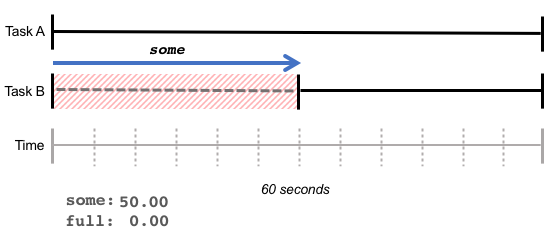
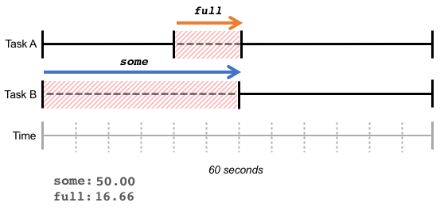

# Cgroup c2 w1 報告

## 1. 已掌握的範圍
### 1.1 看過
- cgroup v2 架構（controllers、subtree_control、層級委派）
- memory controller 的四個層級（max / high / low / min）
- CPU controller（weight vs quota 的選擇）
- systemd Slice / Scope / Service 與 cgroup 樹的對應
- PSI
- IO controller（io.weight、io.max）(未實作)

### 1.2 小實驗
- memtest cgroup 實驗：在 `/sys/fs/cgroup/memtest/` 設 `memory.max=200MB`，跑壓力測試 → 觸發 567 次 OOM kill，驗證限制機制有效、能讀懂 `memory.events` 計數。
- Baseline collector smoke test：本機跑一次採樣 46 個 cgroup，22 個 metric 欄位（memory / CPU / PSI）全部解析正確，user.slice/user-1000.slice 顯示 12GB 與系統實況吻合。

---

## 2. 目前不確定

### 2.1 PSI 的應用方式
```
some avg10=0.42 avg60=0.18 avg300=0.14 total=2539018569
full avg10=0.00 avg60=0.00 avg300=0.00 total=0
```
- some 顯示由於資源不足，例如記憶體不足導致某些（一個或多個）task 延遲的百分比。

- full 表示所有 task 由於資源不足而延遲的時間百分比，即完全無產出的時間量。


| 問題 | 性質 | 
|---|---|---|
| (A) 看哪個訊號（`some` 還是 `full`、`avg10` 還是 `avg60`） | 純技術 | 
| (B) Threshold 設多少 | 數據驅動 | 
| (C) 觸發後做什麼 | 待確定 | 

#### 另外

Meta 有一套（oomd / senpai）自動根據 PSI 監控來自動調整的機制。

### 2.2 Cgroup 「適合的」數值

沒有一個 baseline，決定先收 baseline、再回填數值。流程：
1. baseline 跑 5 天 → 拿到每個 service 的 `memory.peak`、CPU usage 分布
2. 第一版規則：`memory.max ≈ peak × 1.3`、`memory.high ≈ peak × 1.15`
3. Canary 觀察、確認沒踩到實際用量上限後 rollout

---

## 3. Toolkit

### 3.1 結構

```
cgroup/
─ collector/                         # 讀 cgroup 檔案，寫 SQLite
   ─ collect.py                      # 主程式（嵌入 SQLite schema）
   ─ cgroup-baseline.service         # systemd oneshot
   ─ cgroup-baseline.timer           # 每 60 秒觸發
─ ansible/                           # 把資料層推到 server，把規則套上去，砍掉規則
   ─ ansible.cfg
   ─ inventory.example
   ─ group_vars/all.yml              # cgroup_rules 預設 {}
   ─ playbooks/
      ─ deploy-collector.yml
      ─ apply-cgroup-rules.yml
      ─ rollback-cgroup-rules.yml
   ─ roles/
      ─ baseline_collector/         # 部署 collect.py + timer
      ─ cgroup_slice/               # 寫 systemd drop-in
─ report/
   ─ cgroup-progress-2026-05-12-djhih.md   # 本文件
```

### 3.2 設計

#### Collector

- collect.py — 一次性掃 /sys/fs/cgroup 下符合 system.slice/*.service、*.scope、user.slice/user-*.slice 的 cgroup，把 memory / cpu / PSI 寫進 SQLite (/var/lib/cgroup-baseline/samples.db)
- cgroup-baseline.service — Type=oneshot，呼叫 /usr/local/bin/cgroup-baseline-collect
- cgroup-baseline.timer — 每 60s 觸發一次 service

1. systemd timer 每 60 秒呼叫一次
2. [main() 啟動]
    1. 確保 DB 目錄存在 -> 開 SQLite -> 跑 schema
    2. 拿當前 timestamp
    3. discover_cgroups()  ->  yield 出所有要監測的 cgroup 路徑
    4. 對每個 cgroup: sample_one()  ->  讀一堆檔案，組成一個 dict
    5. write_samples()  ->  一次 INSERT 一批
    6. 印一行 log 到 stderr
3. script 退出，等下個 60 秒

#### Ansible delpoy

- ansible.cfg — 預設 inventory 是 inventory.example
inventory.example — 樣板，要複製成 inventory.ini 後填主機
- roles/baseline_collector/tasks/main.yml — 4 個步驟：建資料夾 → 丟 collect.py → 丟 .service → 丟 .timer → enable timer
- playbooks/deploy-collector.yml — 對 baseline_targets group 套用上面的 role

#### Ansible 操作流程

**1. Inventory**

```bash
cp inventory.example inventory.ini
```

**2. 連線檢查**

```bash
ansible -i inventory.ini baseline_targets -m ping
ansible -i inventory.ini baseline_targets -b -m command -a 'id'   # 確認 sudo 可用
```

**3. 部署 collector**

```bash
# Dry-run，看 diff
ansible-playbook -i inventory.ini playbooks/deploy-collector.yml --check --diff

ansible-playbook -i inventory.ini playbooks/deploy-collector.yml --ask-become-pass
```

**4. 驗證**

```bash
systemctl list-timers cgroup-baseline.timer --no-pager     # NEXT 欄有時間
journalctl -u cgroup-baseline.service -n 20 --no-pager     # 看 wrote N samples
ls -lh /var/lib/cgroup-baseline/samples.db                 

sudo sqlite3 /var/lib/cgroup-baseline/samples.db \
  'SELECT cgroup, memory_current, cpu_psi_some_avg60 FROM samples ORDER BY ts DESC LIMIT 10;'
```

**5. 拉資料回 control 機**

```bash
mkdir -p ~/cgroup-data
ansible -i inventory.ini baseline_targets -b -m fetch \
  -a 'src=/var/lib/cgroup-baseline/samples.db dest=~/cgroup-data/ flat=no'
```

**6. 移除 collector**

`playbooks/remove-collector.yml`：stop/disable timer → 刪 unit → daemon-reload → 刪 script。預設**保留** SQLite 資料。

```bash
# Dry-run
ansible-playbook -i inventory.ini playbooks/remove-collector.yml --check --diff

ansible-playbook -i inventory.ini playbooks/remove-collector.yml --ask-become-pass # 刪資料 -e purge_data=true

---

